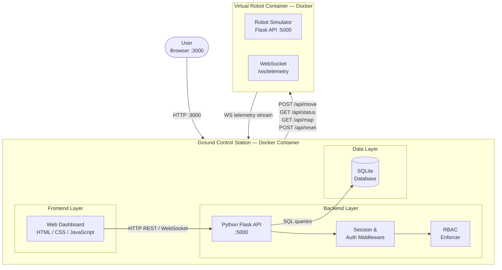

# CMP9134 - Robot Management System

A web-based Ground Control Station dashboard for remotely monitoring and controlling a Virtual Robot.

## Module
CMP9134 Software Engineering | University of Lincoln | 2025-2026

## Overview
This project implements a Robot Management System that connects to a Virtual Robot API (Docker container) and provides:
- Real-time telemetry monitoring (battery, position, status)
- Navigation command interface
- Role-Based Access Control (Viewer / Commander)
- Mission audit logging
- Docker Compose deployment

## System Architecture

The diagram below shows the high-level component architecture and deployment strategy for the Robot Management System.

**Architecture notes:**
- The Ground Control Station (GCS) and Virtual Robot run as separate Docker containers, connected via Docker Compose internal networking using service names (not `localhost`).
- All RBAC enforcement happens inside the Backend Layer — the frontend never has authority over role decisions.
- The SQLite database persists the user table and immutable mission audit log across container restarts.
- The WebSocket `/ws/telemetry` stream provides real-time 1Hz telemetry updates; the system falls back to polling `GET /api/status` if the WebSocket drops.

## Getting Started
Documentation and setup instructions will be added as development progresses.

## GitHub Issues
All user stories and tasks are tracked via [GitHub Issues](../../issues).
