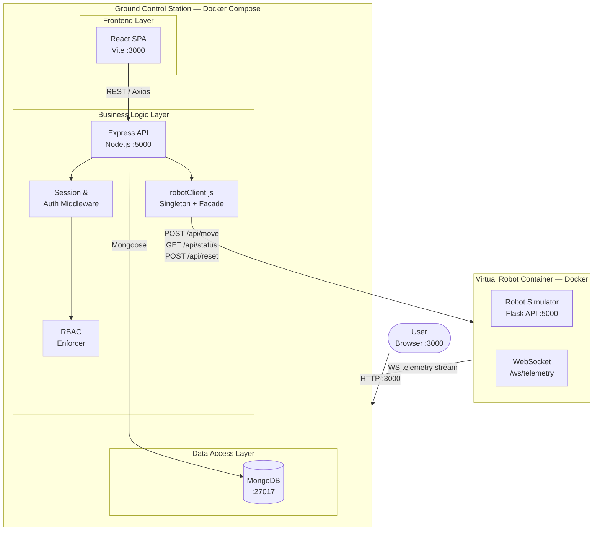

# CMP9134 - Robot Management System

A web-based Ground Control Station dashboard for remotely monitoring and controlling a Virtual Robot.

## Module
CMP9134 Software Engineering | University of Lincoln | 2025-2026

## Overview
This project implements a Robot Management System that connects to a Virtual Robot API (Docker container) and provides:
- Real-time telemetry monitoring (battery, position, status)
- Navigation command interface
- Role-Based Access Control (Viewer / Commander)
- Mission audit logging
- Docker Compose deployment

## Tech Stack

| Layer | Technology |
|---|---|
| Frontend | React (Vite, port 3000) |
| Backend | Node.js + Express (port 5000) |
| Database | MongoDB (Mongoose ODM) |
| HTTP Client | Axios (`robotClient.js` — Singleton + Facade) |
| Deployment | Docker + Docker Compose |
| Virtual Robot | Pre-built Docker image (Flask REST API) |

## System Architecture

The diagram below shows the high-level component architecture and deployment strategy for the Robot Management System.

```mermaid
flowchart TB
    User([User\nBrowser :3000])

    subgraph GCS [Ground Control Station — Docker Compose]
        subgraph Frontend [Frontend Layer]
            UI[React SPA\nVite :3000]
        end

        subgraph Backend [Business Logic Layer]
            API[Express API\nNode.js :5000]
            Auth[Session &\nAuth Middleware]
            RBAC[RBAC\nEnforcer]
            RC[robotClient.js\nSingleton + Facade]
        end

        subgraph Data [Data Access Layer]
            DB[(MongoDB\n:27017)]
        end

        UI -- REST / Axios --> API
        API --> Auth
        Auth --> RBAC
        API --> RC
        API -- Mongoose --> DB
    end

    subgraph Robot [Virtual Robot Container — Docker]
        Sim[Robot Simulator\nFlask API :5000]
        WS[WebSocket\n/ws/telemetry]
    end

    User -- HTTP :3000 --> GCS
    RC -- POST /api/move\nGET /api/status\nPOST /api/reset --> Robot
    Robot -- WS telemetry stream --> GCS
```

**Architecture notes:**
- The GCS (React + Express + MongoDB) and Virtual Robot run as separate Docker containers connected via Docker Compose internal networking.
- All RBAC enforcement happens inside the Express middleware — React cannot bypass it by manipulating client-side state.
- MongoDB persists the User collection and immutable MissionLog collection across container restarts.
- The WebSocket `/ws/telemetry` stream provides real-time 1Hz telemetry updates; the system falls back to polling `GET /api/status` if the WebSocket drops.
- See `docs/ARCHITECTURE.md` for the full layered + MVC breakdown with diagrams.

## Getting Started
Documentation and setup instructions will be added as development progresses.

## GitHub Issues
All user stories and tasks are tracked via [GitHub Issues](../../issues).
