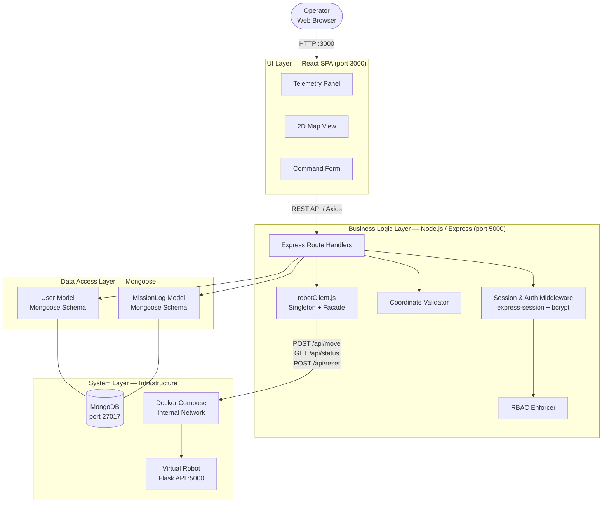
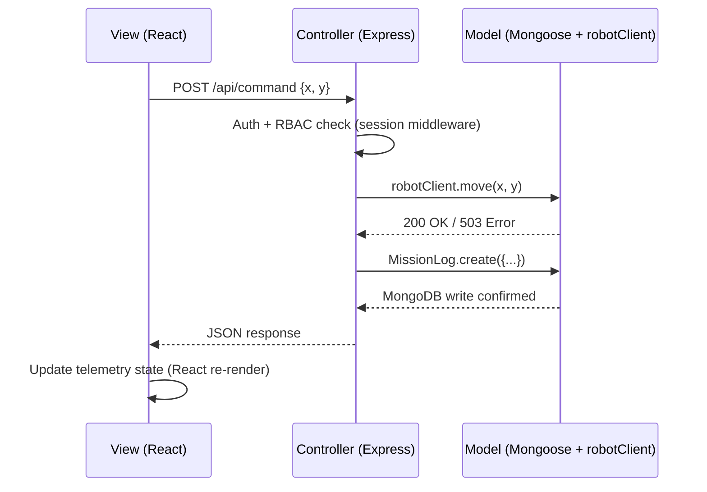

# Architecture — Robot Management System

**Project:** CMP9134 Robot Management System
**Author:** KendoCee25 | University of Lincoln
**Week:** 5 — Architecture, Patterns & Reuse (Lab Sheet 5)

---

## 1. Chosen Tech Stack

| Layer | Technology |
|---|---|
| User Interface | React (JavaScript, Vite) |
| Backend / Controller | Node.js + Express |
| Data / Model | MongoDB (via Mongoose ODM) |
| HTTP Client (Robot API) | `axios` (inside `robotClient.js`) |
| Deployment | Docker + Docker Compose |
| Virtual Robot | Pre-built Docker image (Flask REST API) |

---

## 2. Architectural Pattern

The Ground Control Station follows a **hybrid Layered + MVC architecture**.

**MVC mapping:**

| MVC Role | Technology | Responsibility |
|---|---|---|
| **View** | React SPA | Renders telemetry, 2D map, and command forms; dispatches user events via REST calls to the backend |
| **Controller** | Express route handlers + middleware | Processes HTTP requests, enforces RBAC, validates input, orchestrates data flow |
| **Model** | MongoDB + Mongoose schemas | Stores user accounts and mission log documents; encapsulates business data and state |

**Layered mapping (top → bottom):**

| Layer | Components | Responsibility |
|---|---|---|
| **UI Layer** | React (Vite SPA, port 3000) | Presents live telemetry and map; captures operator commands |
| **Business Logic Layer** | Express routes, Auth middleware, RBAC enforcer, `robotClient.js` | Authentication, session management, role decisions, coordinate validation, outbound robot calls |
| **Data Access Layer** | Mongoose models (`User`, `MissionLog`) | All database reads/writes; abstracts MongoDB documents from route handlers |
| **System Layer** | MongoDB engine, Docker runtime, Virtual Robot container | Infrastructure; not written by this project |

These two patterns are complementary: MVC describes *how requests flow* through the application; the Layered model describes *how code is organised* into tiers.

---

## 3. Layered Architecture Diagram



---

## 4. MVC Request Flow Diagram



---

## 5. Project Folder Structure

```
CMP9134---Robot-Management-System/
├── client/                  ← React SPA (Vite)
│   ├── src/
│   │   ├── components/      ← TelemetryPanel, MapView, CommandForm
│   │   ├── pages/           ← Dashboard, Login, AuditLog
│   │   └── main.jsx
│   └── package.json
│
├── server/                  ← Express API (Node.js)
│   ├── models/
│   │   ├── User.js          ← Mongoose User schema
│   │   └── MissionLog.js    ← Mongoose MissionLog schema
│   ├── routes/
│   │   ├── auth.js          ← /api/auth (login, register)
│   │   ├── command.js       ← /api/command (move, reset)
│   │   └── logs.js          ← /api/logs (audit log, GDPR delete)
│   ├── middleware/
│   │   ├── auth.js          ← session verification
│   │   └── rbac.js          ← role enforcement
│   ├── robotClient.js       ← Singleton + Facade (Task 2)
│   └── server.js            ← Express app entry point
│
├── docker-compose.yml
└── docs/
```

---

## 6. Why This Architecture?

- **Separation of concerns:** React never queries MongoDB directly. Express routes never format HTML. Each layer has one job.
- **Replaceability:** The React SPA could be swapped for a mobile app without touching the Express API. MongoDB could be replaced by PostgreSQL by rewriting the Mongoose models only.
- **Security:** All RBAC enforcement lives inside the Express middleware — React cannot bypass it by manipulating client-side state.
- **Testability:** `robotClient.js` and `CoordinateValidator` can be unit-tested in isolation because they do not depend on Express request context.
