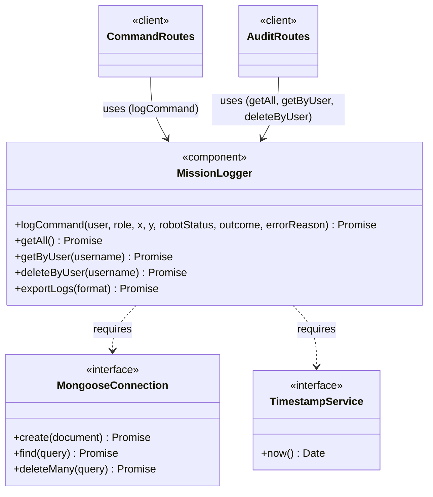

# CBSE Interface Specification — Mission Logger

**Project:** CMP9134 Robot Management System
**Author:** KendoCee25 | University of Lincoln
**Week:** 5 — Architecture, Patterns & Reuse (Lab Sheet 5 — Task 4)

---

## 1. Component Overview

In Component-Based Software Engineering (CBSE), a component is an **abstract, stand-alone service provider** whose behaviour is defined entirely by its interfaces — what it *provides* to others and what it *requires* from the environment.

The **Mission Logger** is a dedicated CBSE component responsible for creating an immutable audit trail of every command issued through the Ground Control Station. It operates independently of the Express route handlers and can, in principle, be replaced or upgraded (e.g., swapping MongoDB for PostgreSQL) without touching any other component.

---

## 2. Provides Interface

These are the services the Mission Logger exposes to the rest of the backend:

| Method | Signature | Description |
|---|---|---|
| `logCommand` | `logCommand(user: string, role: string, x: number, y: number, robotStatus: string, outcome: string, errorReason?: string) → Promise<void>` | Creates an immutable audit document for a command (successful or failed). Both moves and errors are recorded. |
| `getAll` | `getAll() → Promise<LogEntry[]>` | Returns all audit log documents in chronological order. Used by the Auditor role via `GET /api/logs`. |
| `getByUser` | `getByUser(username: string) → Promise<LogEntry[]>` | Returns all log entries attributed to a specific user. Supports a Commander reviewing their own history. |
| `deleteByUser` | `deleteByUser(username: string) → Promise<number>` | Permanently deletes all entries for a user. Required for GDPR Right to Erasure (US-08). Returns the count of deleted documents. |
| `exportLogs` | `exportLogs(format: 'csv' \| 'json') → Promise<Buffer>` | Exports the full audit log as CSV or JSON for compliance reporting. |

---

## 3. Requires Interface

These are the external services the Mission Logger **depends on** to function. It does not implement these itself — it requires them to be provided by the surrounding system.

| External Service | Type | Why it is needed |
|---|---|---|
| **Database Connection** | MongoDB (via Mongoose) | The Logger writes and reads log documents from a durable store. Without an active Mongoose connection, entries cannot be persisted across container restarts. |
| **System Clock / Timestamp Service** | Node.js `Date` / `Date.now()` | Every log entry must record a UTC timestamp at the exact moment the command was issued. |

---

## 4. UML Ball-and-Socket Notation

The "ball" (lollipop) represents the **Provides** interface — a service offered outward.
The "socket" (open arc) represents the **Requires** interface — a dependency that must be satisfied by the environment.

```
                         ┌─────────────────────────┐
                         │                         │
   logCommand ───────●   │                         │   ○──── MongoDB
   getAll     ───────●   │    Mission Logger       │        Connection
   getByUser  ───────●   │       Component         │        (Mongoose)
   deleteByUser──────●   │                         │
   exportLogs ───────●   │                         │   ○──── System Clock /
                         │                         │        Timestamp Service
                         └─────────────────────────┘
```

> **Key:**
> - `●` (ball / lollipop) = **Provides Interface** — services this component offers
> - `○` (socket / open arc) = **Requires Interface** — services this component consumes

---

## 5. Mermaid Diagram (Structural View)



---

## 6. Mongoose Schema (MissionLog Model)

The `MissionLog` Mongoose schema implements the Provides interface's data contract:

```js
// server/models/MissionLog.js
const mongoose = require("mongoose");

const missionLogSchema = new mongoose.Schema({
  username:          { type: String, required: true },
  role:              { type: String, required: true, enum: ["Commander", "Viewer", "Auditor"] },
  targetX:           { type: Number, required: true },
  targetY:           { type: Number, required: true },
  robotStatusAtCmd:  { type: String, required: true },
  outcome:           { type: String, required: true, enum: ["SUCCESS", "ERROR"] },
  errorReason:       { type: String, default: null },
  timestamp:         { type: Date,   default: Date.now },
});

// Immutability: no update/edit operations defined — documents are write-once
module.exports = mongoose.model("MissionLog", missionLogSchema);
```

---

## 7. Design Decisions

- **Immutability:** The Provides Interface exposes no `update` or `edit` method. Log documents are write-once — an audit trail that can be modified defeats its own purpose. The only deletion operation is `deleteByUser`, which exists exclusively for GDPR compliance (US-08).
- **GDPR awareness:** `deleteByUser` is part of the Provides interface because the Mission Logger is the sole authority over its own MongoDB collection. The Express route for GDPR deletion delegates entirely to this method.
- **Decoupling via Requires:** By declaring `MongooseConnection` and `TimestampService` as *required interfaces* rather than hard-coding them, the Mission Logger can be tested with mock implementations (e.g., an in-memory array instead of MongoDB) without any changes to the component itself.
- **Independence:** The Mission Logger does not call `robotClient.js`, `rbac.js`, or any other component. It is a **pure data recorder** — it receives facts about what happened and stores them.
