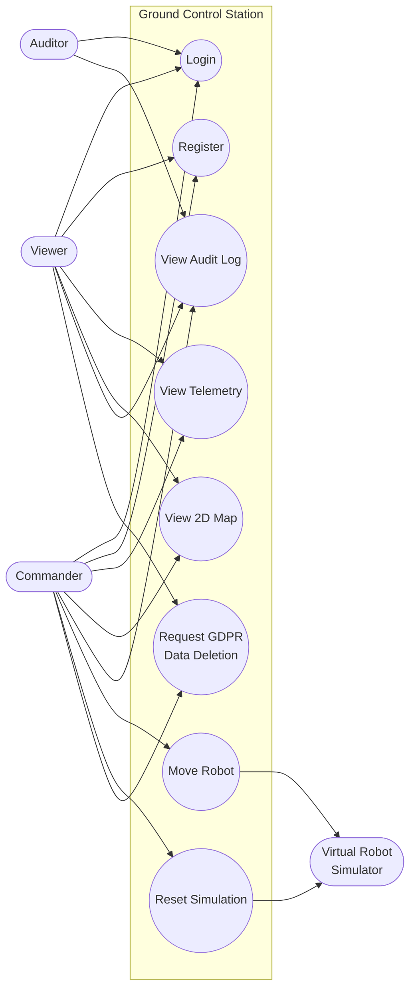
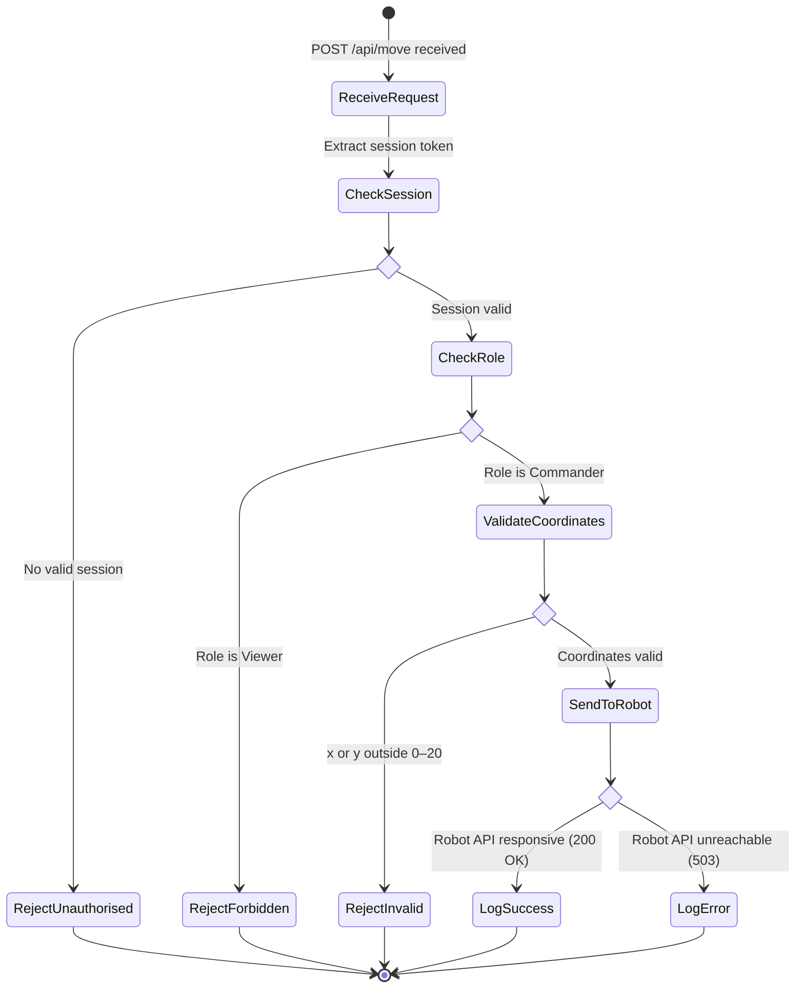
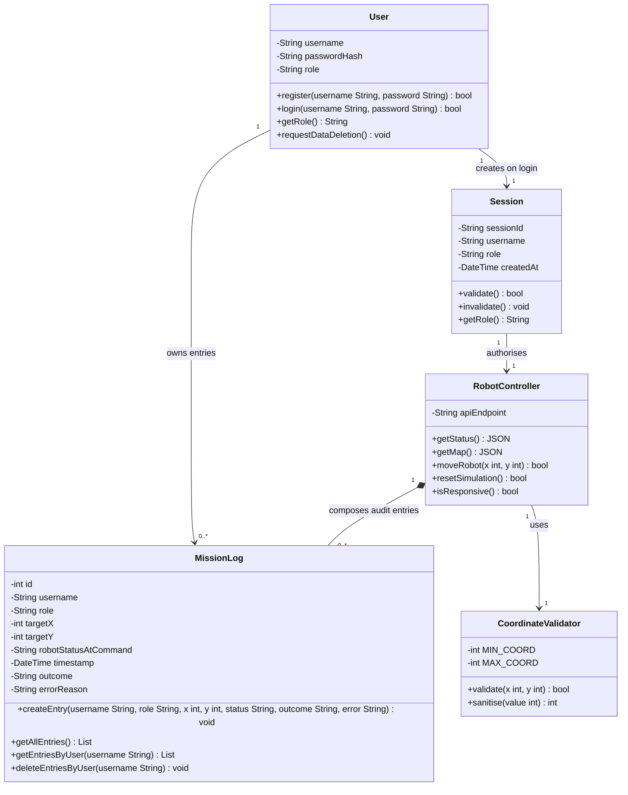

# UML Diagrams — Robot Management System

**Project:** CMP9134 Robot Management System
**Author:** KendoCee25 | University of Lincoln
**Week:** 4 — Software System Modelling (Lab Sheet 4)
**Tool:** Mermaid.js (render on GitHub or at https://mermaid.live)

All diagrams were designed from the system requirements in `USER_STORIES.md` and the live API behaviour documented in `API_ANALYSIS.md`.

---

## Task 1 — Use Case Diagram (External Perspective)

**Goal:** Map the Role-Based Access Control (RBAC) requirements — who uses the Ground Control Station and what each actor is permitted to do.

**Actors:**
- **Commander** — full control: can view telemetry, send movement commands, and reset the simulation
- **Viewer** — read-only: can monitor telemetry and map, cannot issue commands
- **Auditor** — administrative: can view the audit log for compliance review



**Design decisions:**
- `Move Robot` and `Reset Simulation` are connected to the Virtual Robot Simulator as an external actor — the GCS is the system boundary, the simulator is outside it.
- `Viewer` has no line to `Move Robot` or `Reset Simulation` — RBAC is enforced at the system boundary, not just the UI (per US-03 AC).
- `Auditor` is a distinct actor rather than a role variant of Viewer, as audit access is a compliance-only concern.
- `DeleteData` is available to both Commander and Viewer — any authenticated user has GDPR Right to Erasure over their own records (US-08 AC).

---

## Task 2 — Activity Diagram (Behavioral Perspective)

**Goal:** Model the backend business logic executed when a Commander attempts to send a `POST /api/move` command — including role enforcement, coordinate validation, robot API responsiveness, and audit logging.



**Design decisions:**
- Session check happens **before** role check — an unauthenticated request is rejected immediately with `401` before any RBAC logic runs.
- Coordinate validation (0–20) is enforced **server-side** even though the UI also validates — this matches the `NavigationRequest` schema in `/openapi.json` (confirmed in API_ANALYSIS.md).
- Both `LogSuccess` and `LogError` write to the audit log — failed commands are recorded with their error reason (US-08 AC: "Failed commands are also logged with their error reason").
- The split after `SendToRobot` models the `STUCK`/`503` failure scenario identified in the stakeholder persona review (US-07 AC: "Signal lost while robot is MOVING").

---

## Task 3 — Class Diagram (Structural / OOP Perspective)

**Goal:** Define the Object-Oriented architecture of the backend — classes, attributes, methods, and their relationships.



**Design decisions:**
- `passwordHash` is private (`-`) — password is never stored in plain text and is not accessible outside the class (US-01 AC: "hashed with Bcrypt").
- `role` is stored on both `User` (in DB) and `Session` (in memory) — the session role is read from the DB on every request, never trusted from the client claim (US-03 AC: "Role is read from server-side session/database on every request").
- `MissionLog` uses **composition** with `RobotController` (filled diamond) — log entries are created by the controller and cannot exist without it being invoked. However, log entries themselves are **immutable** — no `update` or `delete` operation exists on entries, only `deleteEntriesByUser` for GDPR compliance (US-08 AC).
- `CoordinateValidator` is a separate class with its own `MIN_COORD`/`MAX_COORD` constants — makes the 0–20 constraint a single source of truth, testable in isolation (US-09 AC: "Unit tests cover coordinate validation").
- `errorReason` on `MissionLog` captures 422/503 error details for failed commands.

---

## Task 4 — Sequence Diagram (Interaction Perspective)

**Goal:** Trace the full chronological execution of a `Move Robot` command — from the Commander clicking the UI button, through session verification, robot API call, and audit log write, back to the UI.

```mermaid
sequenceDiagram
    actor C as Commander
    participant UI as Web Dashboard
    participant API as Python/Flask Backend
    participant DB as SQLite Database
    participant Sim as Virtual Robot (Docker)

    C->>UI: Enter X=5, Y=10 and click 'Move'
    UI->>UI: Client-side validation (0–20, required fields)

    UI->>API: POST /api/command {x: 5, y: 10}
    activate API

    API->>API: Verify session token
    API->>DB: SELECT role FROM users WHERE session_id = token
    DB-->>API: role = "Commander"

    alt Role is Viewer
        API-->>UI: 403 Forbidden
        deactivate API
    else Role is Commander
        API->>API: Validate coordinates (0 ≤ x,y ≤ 20)

        alt Coordinates invalid (422)
            API-->>UI: 422 Unprocessable Entity
            deactivate API
        else Coordinates valid
            API->>Sim: POST /api/move {x: 5, y: 10}

            alt Sim responsive
                Sim-->>API: 200 OK {status: MOVING}
                API->>DB: INSERT INTO mission_log (username, role, x, y, status, outcome, timestamp)
                DB-->>API: Write confirmed
                API-->>UI: 200 OK {message: "Navigating to (5, 10)"}
            else Sim unreachable (503)
                API->>DB: INSERT INTO mission_log (username, role, x, y, status, outcome="ERROR", error_reason="503")
                DB-->>API: Write confirmed
                API-->>UI: 503 Service Unavailable
            end

            deactivate API
        end
    end
```

**Design decisions:**
- Session token is verified against the **database** on every request — the role is never read from a client-provided claim (US-03 AC: "Role is read from server-side session/database on every request").
- The `DB` participant appears **before** `Sim` in the auth step and **after** `Sim` in the log step — this correctly models that auth is a prerequisite to calling the robot, and logging is a consequence of the outcome.
- Both the `200 OK` and `503` paths write to the audit log — failed commands are still recorded (US-08 AC).
- The `alt` block for role check exits early (`deactivate API`) — the backend terminates the request immediately on a 403, it does not proceed further down the chain.
- Client-side validation is shown as a self-call on `UI` before the API request — this reflects the AC that "client-side validation blocks the request" but does not replace server-side validation.
