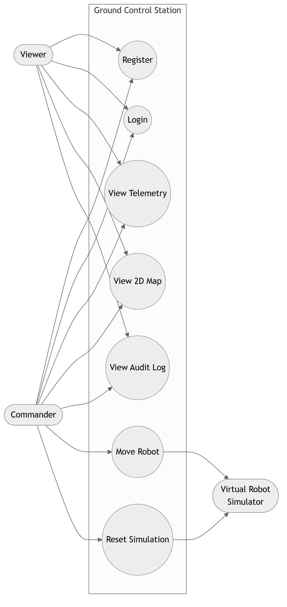
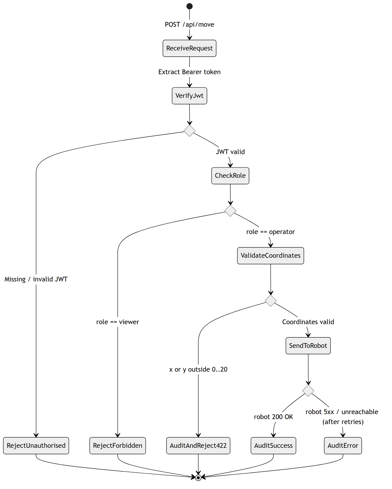
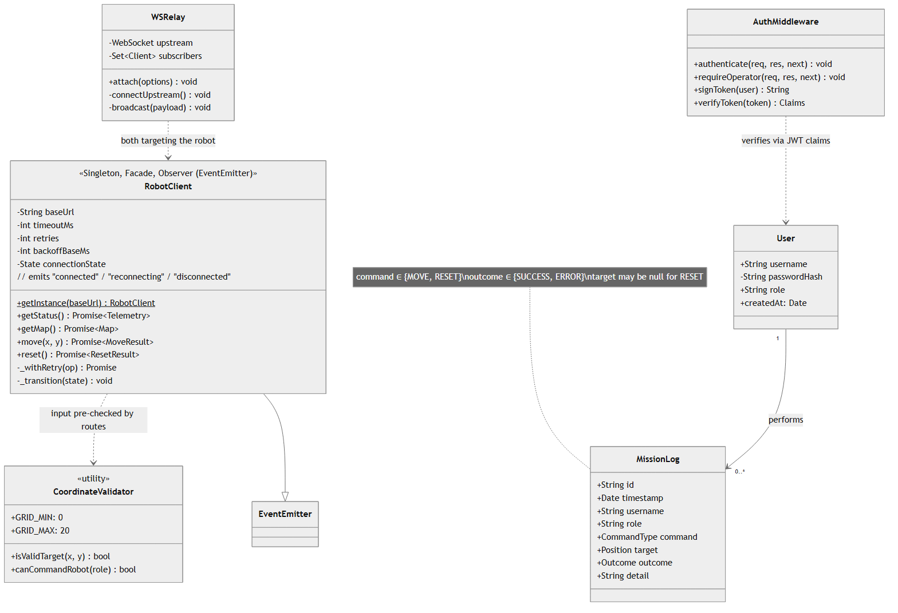
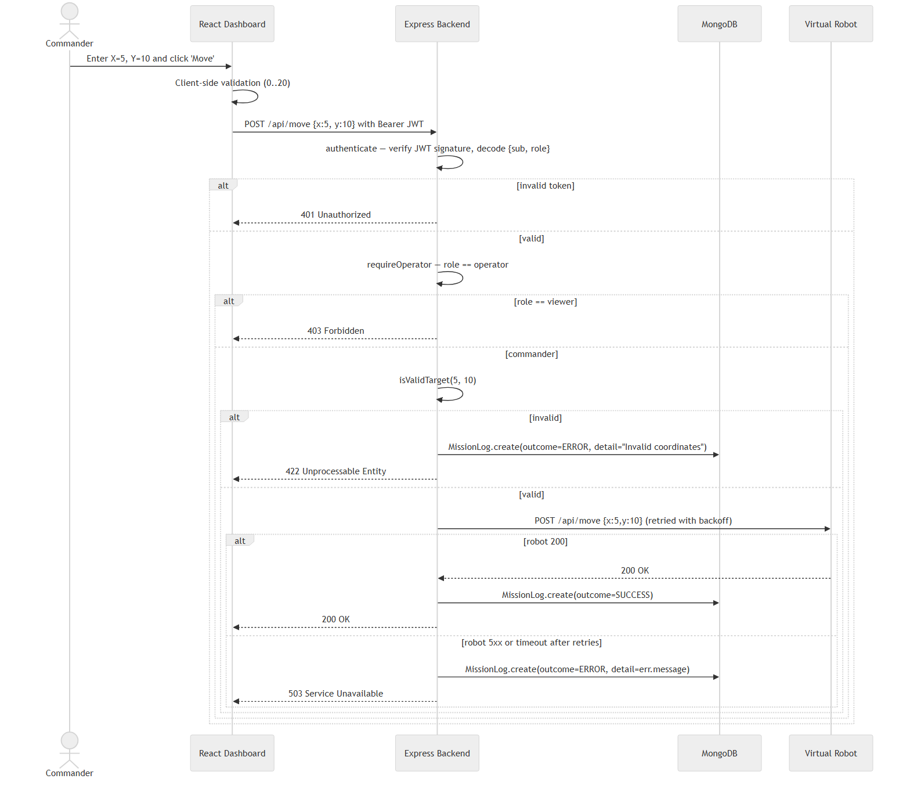
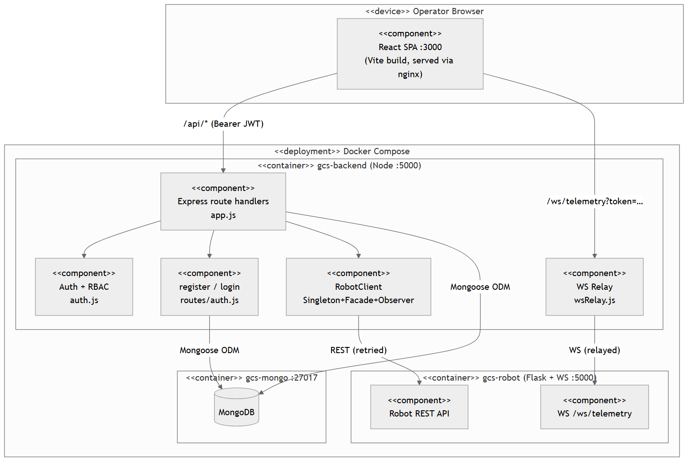

# UML Diagrams — Robot Management System

**Project:** CMP9134 Robot Management System
**Author:** KendoCee25 | University of Lincoln
**Originated:** Week 4 — Software System Modelling (Lab Sheet 4)
**Last revised:** to match the implemented code in `server/` and `client/`.
**Tool:** Mermaid.js (render on GitHub or at https://mermaid.live)

All diagrams trace back to the requirements in `USER_STORIES.md` and the live API behaviour in `API_ANALYSIS.md`.

---

## Task 1 — Use Case Diagram (External Perspective)

**Goal:** Map the Role-Based Access Control (RBAC) requirements — who uses the Ground Control Station and what each actor is permitted to do.

**Actors:**
- **Commander** (`role = operator`) — full control: telemetry, map, audit log, plus move + reset.
- **Viewer** (`role = viewer`) — read-only: telemetry, map, audit log.

**Design decisions:**
- `Move Robot` and `Reset Simulation` connect to the Virtual Robot as an external actor — the GCS is the system boundary, the simulator is outside it.
- `Viewer` has no edge to `Move Robot` or `Reset Simulation` — RBAC is enforced in the backend (`requireOperator` in `server/auth.js`), not just hidden in the UI.

---

## Task 2 — Activity Diagram (Behavioural Perspective)

**Goal:** Model the backend business logic executed when a Commander sends a `POST /api/move`.

**Design decisions:**
- JWT verification happens **before** role check — an unauthenticated request is rejected with `401` before any RBAC logic runs.
- Coordinate validation (0–20) is enforced **server-side** even though the UI also validates — matches the robot's `NavigationRequest` schema.
- Invalid coordinates are **also audited** (with `outcome=ERROR`, `detail=Invalid coordinates`) — the brief requires every command attempt to be auditable.
- The robot leg is retried with exponential backoff inside `robotClient._withRetry` before the failure path is taken.

---

## Task 3 — Class Diagram (Structural / OOP Perspective)

**Goal:** Define the OO architecture of the backend — the classes, design patterns, and their relationships.

**Design decisions:**
- `RobotClient` carries three stereotypes — **Singleton** (one instance per process), **Facade** (`getStatus/move/reset/getMap` hide HTTP + retry + error mapping), and **Observer** (extends `EventEmitter`, emits connection-state transitions). These satisfy three of the four design patterns the brief names by example.
- `MissionLog` is **immutable** at the application layer — no `update` or `delete` is exposed on it; only append (`recordEntry`) and read (`listEntries`).
- `CoordinateValidator` is a pure module (`validation.js`) — testable in isolation without Express or Mongo.
- Auth state lives in a **signed JWT**, not a server-side session table. The claims `{ sub, role }` are the source of truth on every request — they are never trusted from a client-sent body.

---

## Task 4 — Sequence Diagram (Interaction Perspective)

**Goal:** Trace the full chronology of a `Move Robot` command — UI click → JWT verification → robot call → audit write → UI update.

**Design decisions:**
- The JWT is verified by signature, not against a DB lookup — that's the whole point of using JWTs over server-side sessions. The role used for the RBAC check is the role in the signed claims.
- Audit writes happen on **every terminal branch except 401/403** — the brief requires every command intent (including 422s) to be auditable. 401s aren't audited because we never reach the route handler.
- The robot call is wrapped inside `robotClient._withRetry`; the failure path on this diagram only fires *after* exponential backoff retries have been exhausted.

---

## Task 5 — Component Diagram (Deployment & Interface Perspective)

**Goal:** Show the high-level runtime components, their interfaces, and how they connect across Docker containers.

**Design decisions:**
- The dashboard **never talks to the robot directly**. Both REST and WebSocket traffic terminate at the backend, which enforces JWT auth + RBAC on every request and relays the WS so a single upstream connection is shared by all browser subscribers.
- nginx serves the built SPA inside `gcs-frontend` and reverse-proxies `/api` and `/ws` to `gcs-backend` (see `client/nginx.conf`).
- All inter-container references use Docker Compose service names (`mongo`, `robot`, `backend`) — no hard-coded localhosts.
- The four containers are wired in `docker-compose.yml`; the backend `depends_on` mongo with a `service_healthy` condition so the audit log writes never race the database boot.
